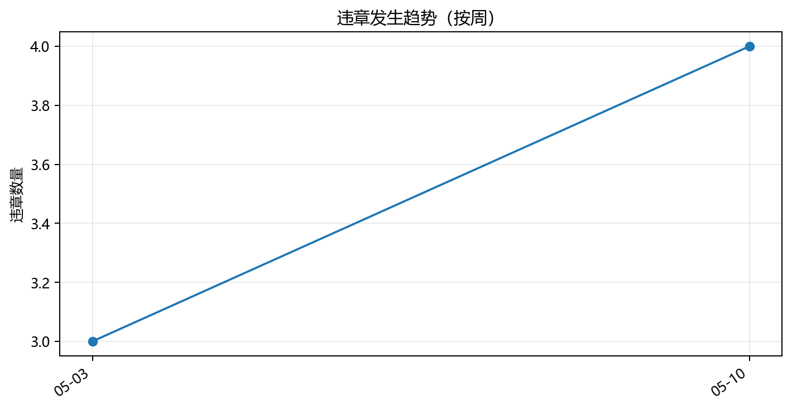
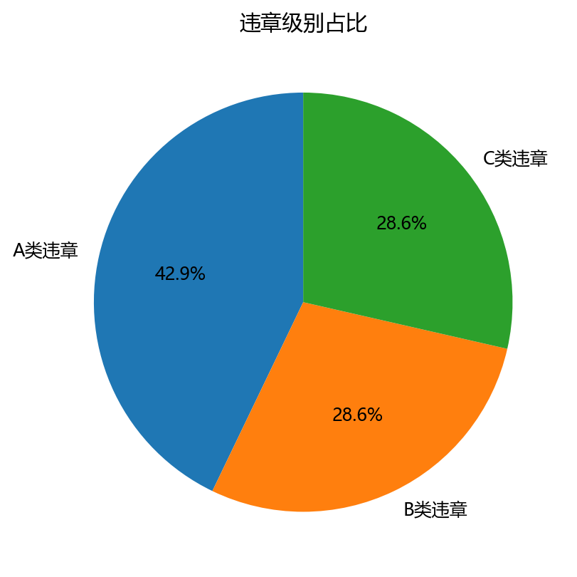
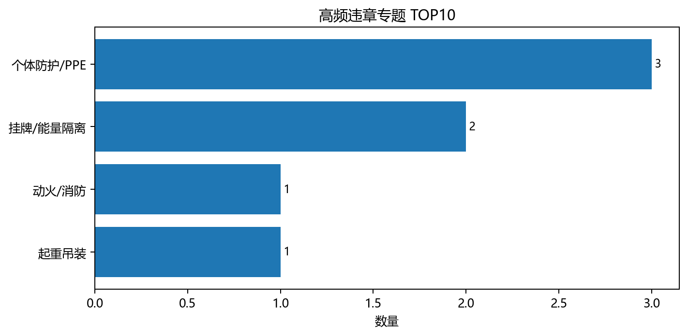
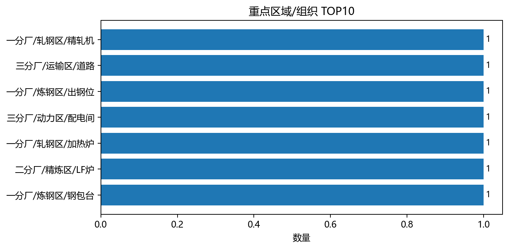
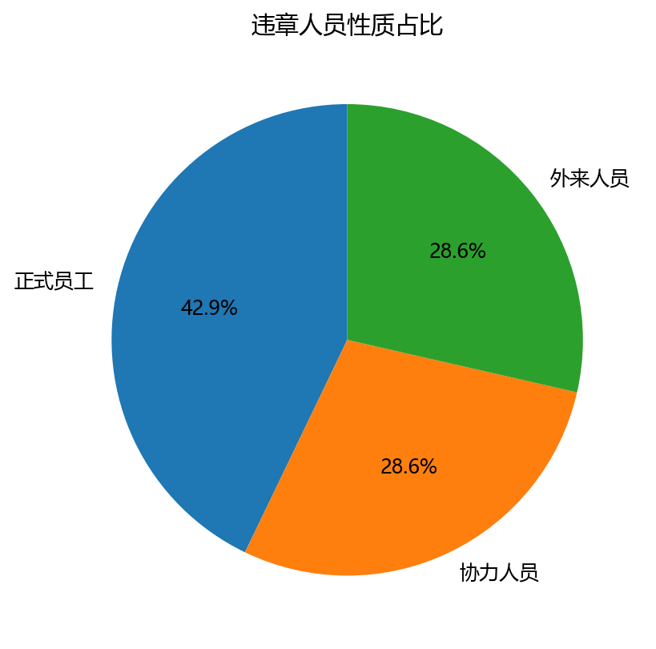
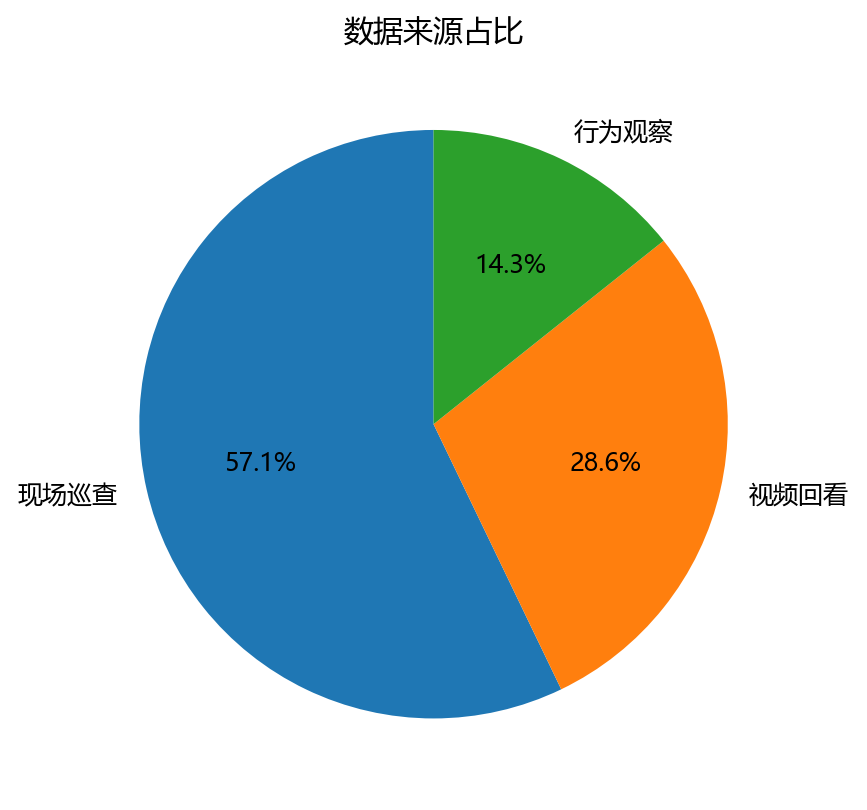

# 安全生产违章情况深度分析与改进建议报告

💡 **提示**：本分析已同步生成专业格式的报告文档，您可直接下载：
- 📝 **[点击下载 Word 报告](./output_test.docx)**
- 📄 **[点击下载 PDF 报告](./output_test.pdf)**

- 报告日期：2026年05月19日
- 数据周期：2026-05-01 至 2026-05-15
- 数据口径：剔除“已删除”记录，共 7 条有效违章明细；如源文件为“不含连带”导出，则连带责任仅作定性参考。

## 一、总体概况与核心判断

本次分析共识别 7 条有效违章记录，累计记分约 44 分。A类或重大违章约 3 起，占比 42.9%。数据表明，安全风险不是单点偶发，而是在人员行为、现场执行、协力单位管理和作业许可链条中呈现重复发生特征。
从级别结构看，A类违章 数量最高；从专题归类看，个体防护/PPE 是最突出的高频问题。建议把高频且高后果的专题纳入厂级专项治理。

| 项目 | 数量 | 占比 |
| --- | ---: | ---: |
| A类违章 | 3 | 42.9% |
| B类违章 | 2 | 28.6% |
| C类违章 | 2 | 28.6% |

## 二、高频违章与重点区域画像

TOP 专题显示，个体防护/PPE、挂牌/能量隔离 等问题重复出现，通常对应制度执行弱化、班组日常纠偏不足和现场监督穿透力不足。

### 高频违章专题 TOP10

| 项目 | 数量 | 占比 |
| --- | ---: | ---: |
| 个体防护/PPE | 3 | 42.9% |
| 挂牌/能量隔离 | 2 | 28.6% |
| 起重吊装 | 1 | 14.3% |
| 动火/消防 | 1 | 14.3% |

### 重点区域/组织 TOP10

| 项目 | 数量 | 占比 |
| --- | ---: | ---: |
| 一分厂/炼钢区/钢包台 | 1 | 14.3% |
| 二分厂/精炼区/LF炉 | 1 | 14.3% |
| 一分厂/轧钢区/加热炉 | 1 | 14.3% |
| 三分厂/动力区/配电间 | 1 | 14.3% |
| 一分厂/炼钢区/出钢位 | 1 | 14.3% |
| 三分厂/运输区/道路 | 1 | 14.3% |
| 一分厂/轧钢区/精轧机 | 1 | 14.3% |

## 三、人员性质、协力单位与数据来源分析

人员性质分布显示，正式员工 违章数量最高，占比 42.9%。若协力人员占比较高，应重点审视准入培训、作业交底、甲方监护和合同考核闭环。

数据来源中，现场巡查 占比最高。若行为观察/视频回看占比较高，说明技术监督有效，但也反映现场管理者事中制止不足，需提升现场巡查质量。

## 四、管理体系短板与根因诊断

1. 风险预控与安全交底流于形式：作业前危险源辨识不充分，交底内容模板化，工票或许可签发未形成真实约束。
1. 核心制度执行衰减：挂牌、联锁、PPE 等低技术门槛要求反复失守，说明班组日常纠偏和管理问责不足。
1. 高风险作业升级管控不足：动火、高处、起重、设备检修等作业未做到许可、确认、监护、复盘闭环。
1. 协力单位穿透式管理不足：甲方对协力队伍的准入、交底、过程监督和绩效联动不足，易形成“以包代管”。
1. 安全培训未转化为行为习惯：员工知道制度但未敬畏风险，说明培训缺少场景化、体验式和实操验证。

## 五、改进建议与行动清单

| 措施 | 主要做法 | 责任主体 | 验证指标 |
| --- | --- | --- | --- |
| 立即开展高频问题专项整治 | 围绕挂牌/能量隔离、PPE、动火、高处、起重等专题开展 1-3 个月专项行动，执行零容忍停工整改。 | 厂部/分厂/作业区/协力单位 | 违章数下降、A类清零、重复违章减少、闭环率100% |
| 重构高风险作业许可 | 许可签发人、作业负责人、监护人必须现场逐项确认并拍照留痕；关键风险点使用清单化确认。 | 厂部/分厂/作业区/协力单位 | 许可执行率提升、违规作业显著下降 |
| 强化管理人员履职量化 | 建立班组长、作业长、分厂管理者安全履职清单，将制止违章、现场巡查、交底审核与绩效挂钩。 | 厂部/分厂/作业区 | 现场纠偏频次提升、重复问题下降 |
| 实施协力单位等同管理 | 协力人员参加同等培训和班前会；月度发布协力单位安全积分，并与合同结算、清退机制联动。 | 厂部/采购/协力单位 | 协力违章占比下降、准入合规率提升 |
| 推进工程技术防呆 | 对钢包、剪切、步进梁、小车运行区等高风险点推广硬隔离、联锁、权限钥匙和感应停机。 | 设备/工艺/安全部门 | 同类机械伤害风险下降 |
| 建立数据驱动闭环 | 每周更新违章看板，每月组织跨部门复盘，针对异常升高专题形成整改责任书并跟踪验证。 | 安全管理部门 | 整改按期完成率提升、异常专题响应时效缩短 |

## 六、附录：数据字段与口径提示

本报告由 Excel 字段自动统计生成。若源数据含有更细的责任链条、连带记分、隐患编号或整改闭环字段，可进一步扩展为责任追溯、隐患闭环率和整改有效性分析。
